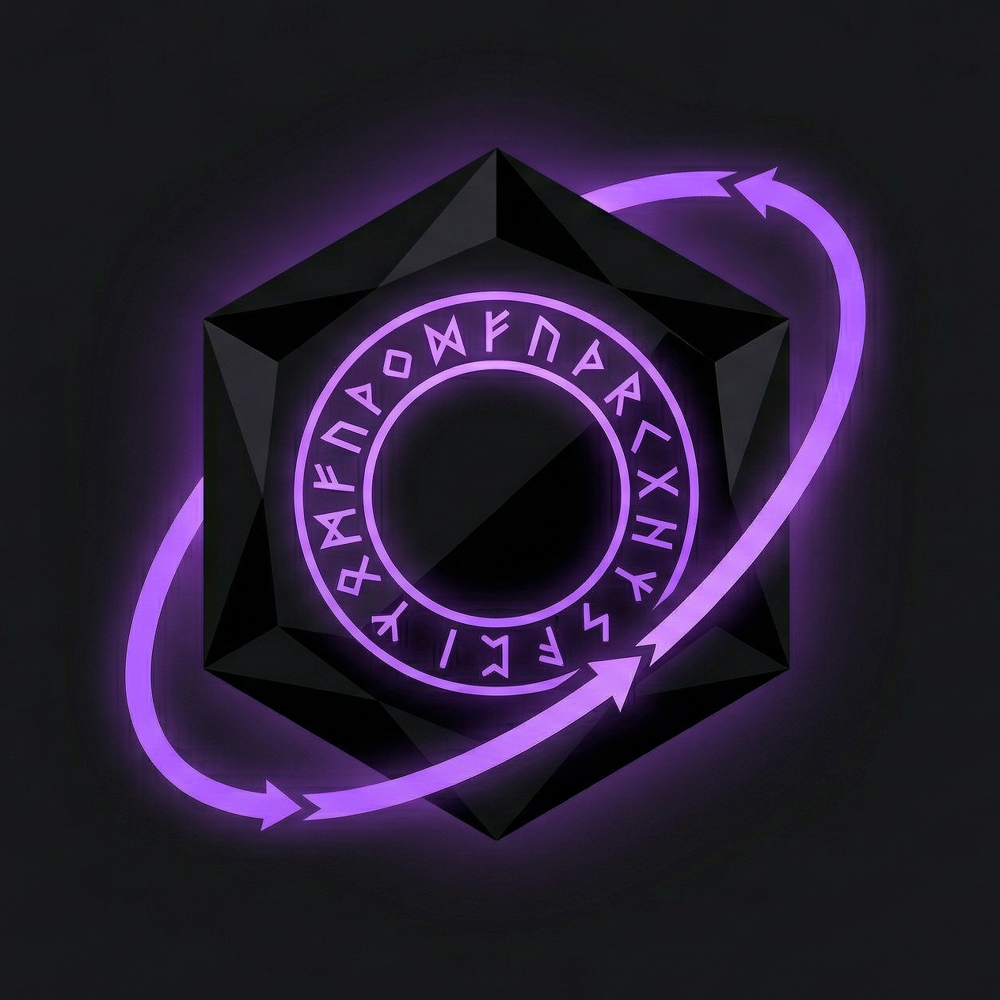
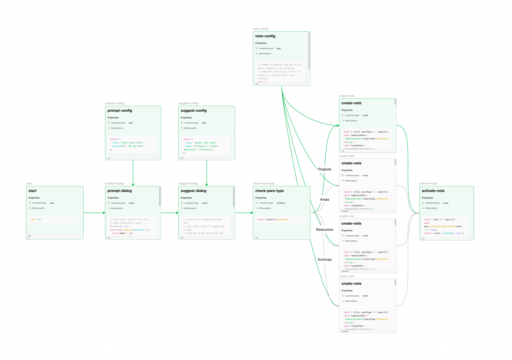

# Runestone

<p align="center">
	
</p>

Build and execute workflows on Obsidian Canvas.

Runestone turns canvas files into executable workflow diagrams. Nodes are notes with code blocks, edges define data flow, and execution supports sequential, parallel, conditional branching, and cycles.



## Features

- Execute shell commands or JavaScript from canvas nodes
- Conditional branching with labeled edges
- Parallel execution when nodes have multiple outgoing edges
- Data flow between nodes via template syntax (`{{input[n].property}}`)
- Real-time execution visualization on canvas (status colors and overlays)
- Log panel with per-node output (pretty-printed JSON), stdout/stderr, and duration
- Cycle support with configurable iteration limits
- Per-node error handling (stop or continue)

## Getting Started

### Installation

**Using [BRAT](https://github.com/TfTHacker/obsidian42-brat):**

1. Install the BRAT plugin
2. Add `handlename/obsidian-plugin-runestone` as a beta plugin in BRAT settings

**Manual:**

Copy `main.js`, `styles.css`, and `manifest.json` to `<vault>/.obsidian/plugins/runestone/`.

### Creating a Workflow

1. Create a new canvas file (or use the "New workflow" command)
2. Add a Canvas **text node** containing exactly `runestone:start`. This marks the workflow entry point. Every workflow must have exactly one start marker.
3. Add note nodes to the canvas. Each note needs:
   - Frontmatter with `runestone.type` set to `exec`, `script`, or `condition`
   - A code block containing the command or script to run
4. Connect the `runestone:start` text node to the first note, then connect the remaining notes with edges to define execution order
5. (Optional) Add `runestone:end` text nodes where execution should halt. Reaching any end marker stops the entire workflow gracefully.

> Upgrading from v0.2 or earlier? See [MIGRATION.md](./MIGRATION.md) for the v0.3 breaking changes.

### Running a Workflow

- Open a canvas and click the play button in the view header
- Or use the command palette: "Run current canvas"
- Or right-click a node: "Runestone: Run from this node" (starts execution from that node)
- Register workflows in settings to add dedicated commands

## Node Types

### exec

Executes a shell command. The first code block in the note body is run as a shell command. stdout must be valid JSON, which becomes the node output. The `{{input[n].key}}` template syntax can be used in the command body, `exec.env` values, and `exec.workdir`.

> **Note**: `{{args.key}}` syntax is deprecated and always resolves to an empty object. It is preserved for backward compatibility only.

````markdown
---
runestone.type: exec
---

```bash
echo '{"message": "hello {{input[0].name}}"}'
```
````

### script

Executes JavaScript asynchronously. Available variables: `app` (Obsidian App instance), `obsidian` (the `obsidian` module, e.g. `Modal`, `Notice`, `SuggestModal`), and `input` (array of outputs from upstream nodes).

> **Note**: The `args` variable is deprecated and always equals `{}`. It is preserved for backward compatibility only.

The return value becomes the node output.

````markdown
---
runestone.type: script
---

```javascript
const result = input[0].message.toUpperCase();
return { result };
```
````

### condition

Evaluates JavaScript and returns a value that is stringified and matched against outgoing edge labels. Must have at least one labeled outgoing edge. An optional unlabeled edge serves as a default (like `default` in a switch statement) when no label matches. Available variables: `app`, `obsidian`, and `input` (same as script).

> **Note**: The `args` variable is deprecated and always equals `{}`. It is preserved for backward compatibility only.

The original `input` is passed through to the next node, not the condition's return value. Multiple labeled edges may point to the same target node.

````markdown
---
runestone.type: condition
---

```javascript
return input[0].count > 10 ? "high" : "low";
```
````

Workflows may contain cycles. Every cycle must include a condition node with at least one exit edge leading outside the cycle.

### start

A Canvas **text node** whose trimmed content is exactly `runestone:start`. Marks the workflow entry point. Has no payload and produces no output. Every workflow must contain exactly one start marker, with no incoming edges and one or more outgoing edges. Successors of the start marker receive an empty input.

```
runestone:start
```

Moving the start marker's outgoing edge to a different node is a quick way to redirect the entry point for partial-execution debugging — nodes that become unreachable are silently skipped.

### end

A Canvas **text node** whose trimmed content is exactly `runestone:end`. Marks a halt point. Reaching any end marker stops the workflow gracefully: no new nodes are scheduled, but in-flight `exec` and `script` nodes complete naturally. A workflow may contain zero or more end markers; each must have one or more incoming edges and no outgoing edges.

```
runestone:end
```

## Frontmatter Reference

All properties use the `runestone.` prefix. Properties without this prefix are ignored.

### Common Properties

| Property | Values | Default | Description |
|---|---|---|---|
| `runestone.type` | `exec`, `script`, `condition` | (required) | Node type |
| `runestone.onError` | `stop`, `continue` | `stop` | Error handling strategy |

- `stop`: abort the entire workflow and skip all remaining nodes
- `continue`: skip only the downstream nodes of the failed node; other branches continue

### exec-Specific Properties

| Property | Description |
|---|---|
| `runestone.exec.workdir` | Working directory for the command |
| `runestone.exec.shell` | Shell to use (e.g., `/bin/bash`) |
| `runestone.exec.env.<NAME>` | Environment variable (e.g., `runestone.exec.env.API_KEY: "xxx"`) |

All exec-specific properties are optional. Defaults come from plugin settings or system defaults.

## Template Syntax

Nodes can reference outputs from upstream nodes using `{{input[n].property}}`.

- `input` is an array of outputs from all incoming edges
- All expressions must start with `input`
- Supports dot notation and bracket notation: `{{input[0].data.items[1].name}}`
- Multiple templates in one string: `echo '{"a": "{{input[0].x}}", "b": "{{input[1].y}}"}'`
- Strings are passed as-is; numbers and booleans are converted to strings; objects and arrays are converted to JSON

The immediate successors of the `runestone:start` marker receive an empty input (`[{}]`), so `{{input[0].key}}` references are not meaningful there.

## Settings

| Setting | Description | Default |
|---|---|---|
| Default working directory | Default `cwd` for exec nodes | Vault root |
| Default shell | Default shell for exec nodes | System default |
| Maximum cycle iterations | Prevents infinite loops in cyclic workflows | 1000 |
| Registered workflows | Named workflows with dedicated commands | (none) |

## Claude Code Skill: runestone-workflow

A [Claude Code](https://claude.com/claude-code) skill that helps AI agents create and modify Runestone workflows. When this skill is installed, you can ask Claude Code to build, edit, or extend workflows on Obsidian Canvas using natural language.

### Installation

Run the following commands in Claude Code:

```
/plugin marketplace add https://github.com/handlename/obsidian-plugin-runestone
/plugin install runestone-workflow
```

### Usage

Once the skill is available, you can invoke it from Claude Code with the `/runestone-workflow` command or natural language prompts like:

- `"Create a workflow that fetches an API and filters the results"`
- `"Add a condition node to branch on status code"`
- `"Edit the workflow to add error handling"`

The skill handles `.canvas` JSON files and node `.md` files, following Runestone's layout conventions and validation rules automatically.

## Example Vault

The [`vault.example/`](./vault.example/) directory contains an example Obsidian vault with a sample workflow. You can open it as a vault in Obsidian to try Runestone immediately.

### Included Workflow: para-note

A workflow that creates a new note following the [PARA method](https://fortelabs.com/blog/para/). It demonstrates:

- **Interactive dialogs** — prompt and suggest nodes for user input
- **Conditional branching** — routes to different folders (Projects, Areas, Resources, Archives) based on PARA type
- **Join execution** — all branches converge to a final activation node

To run: open `workflows/para-note/para-note.canvas` and click the play button.

## Development

```bash
npm install
npm run dev      # Watch mode compilation
npm run build    # Production build
npm run test     # Run tests (vitest)
npm run lint     # Lint with ESLint
```

## License

[MIT](./LICENSE)

## Author

[handlename](https://github.com/handlename/)
